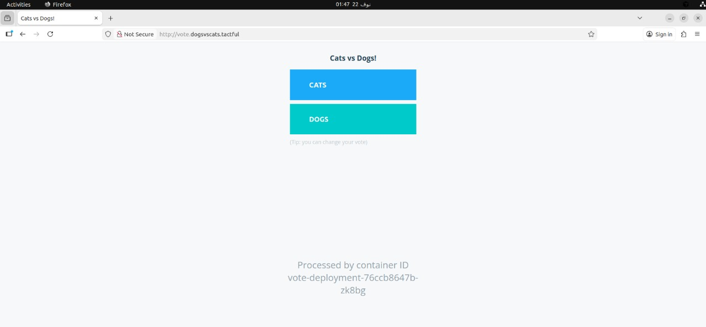
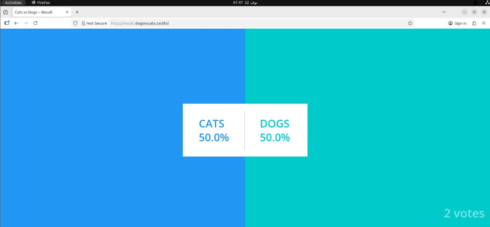
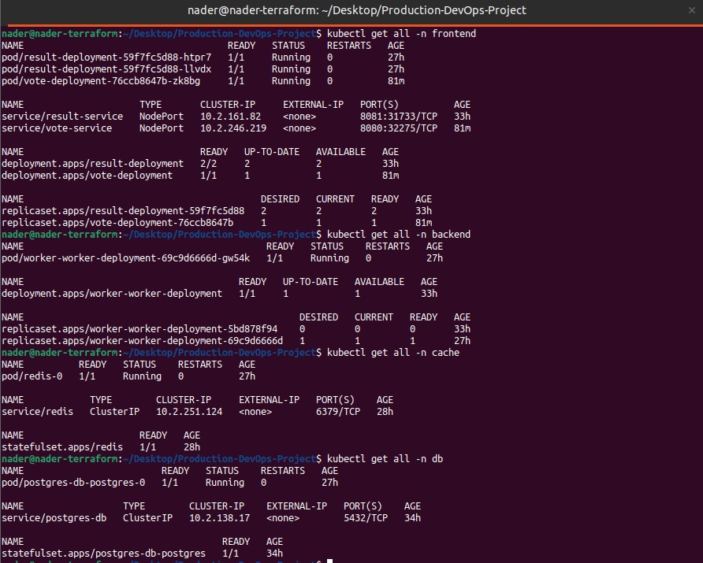
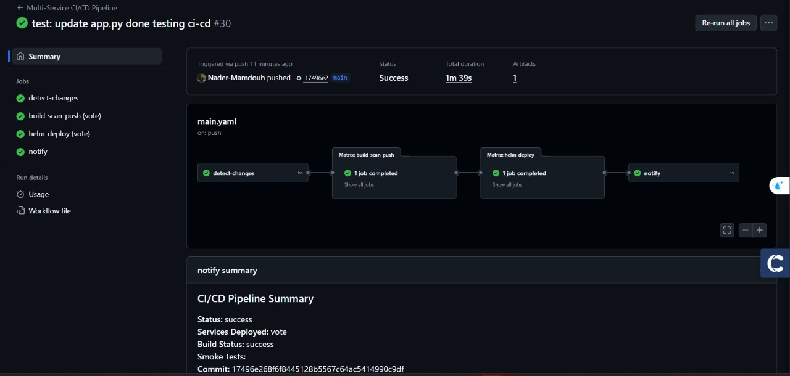
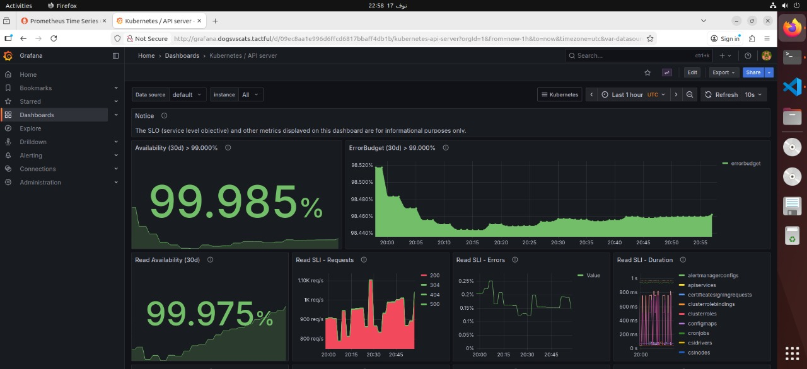
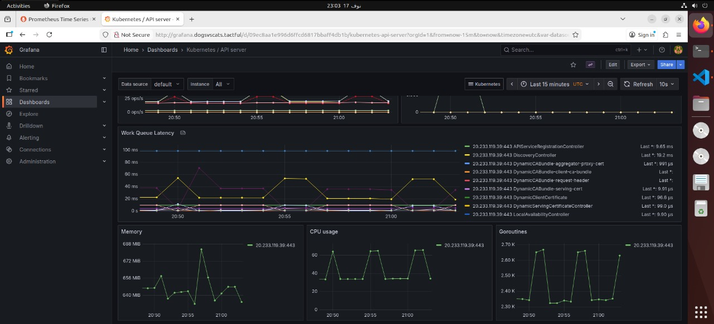

# Production DevOps Project - Distributed Voting Application

A production-ready, cloud-native distributed voting application (Dogs vs Cats) built with microservices architecture. This project demonstrates modern DevOps practices including containerization, Kubernetes orchestration, infrastructure as code, CI/CD pipelines, and comprehensive monitoring.


## 📸 Screenshots & Visualizations

This section showcases the application and infrastructure in action.

### Application UI


*Vote service interface - Users can vote between Dogs and Cats*


*Result service interface - Real-time voting results with WebSocket updates*

### Infrastructure & Deployment


*Kubernetes dashboard showing all deployed pods and services*


*GitHub Actions CI/CD pipeline execution showing build, scan, and deploy stages*


### Monitoring & Observability


*Prometheus metrics collection and query interface*


*Grafana visualization and monitoring dashboards*


## 🎯 Project Overview

This is a distributed voting application that allows users to vote between two options (Dogs vs Cats) and view real-time results. The application is designed with a microservices architecture, deployed on Kubernetes, and includes complete infrastructure automation, monitoring, and CI/CD pipelines.

### Key Features

- **Microservices Architecture**: Decoupled services for scalability and maintainability
- **Real-time Updates**: WebSocket-based real-time result updates
- **High Availability**: Multi-replica deployments with health checks
- **Infrastructure as Code**: Terraform for cloud infrastructure provisioning
- **Container Orchestration**: Kubernetes manifests and Helm charts
- **CI/CD Pipeline**: Automated build, scan, and deployment with GitHub Actions
- **Monitoring Stack**: Prometheus, Grafana, and Alertmanager for observability
- **Security**: Non-root containers, security scanning, and best practices

## 🏗️ Architecture

### Application Components

```
┌─────────────┐      ┌─────────────┐
│    Vote     │─────▶│    Redis    │
│  (Frontend) │      │   (Cache)   │
└─────────────┘      └─────────────┘
                            │
                            ▼
                     ┌─────────────┐
                     │   Worker    │
                     │  (Backend)  │
                     └─────────────┘
                            │
                            ▼
┌─────────────┐      ┌─────────────┐
│   Result    │─────▶│ PostgreSQL  │
│  (Frontend) │      │  (Database) │
└─────────────┘      └─────────────┘
```

### Services

1. **Vote Service** (`/vote`)
   - **Technology**: Python Flask
   - **Port**: 8080
   - **Purpose**: User-facing voting interface
   - **Connects to**: Redis (for vote queuing)

2. **Result Service** (`/result`)
   - **Technology**: Node.js with Socket.io
   - **Port**: 8081
   - **Purpose**: Real-time results display with WebSocket updates
   - **Connects to**: PostgreSQL (for reading results)

3. **Worker Service** (`/worker`)
   - **Technology**: .NET Core Worker Service
   - **Purpose**: Background worker that processes votes from Redis and stores them in PostgreSQL
   - **Connects to**: Both Redis (reads votes) and PostgreSQL (writes results)

4. **Redis** (`redis:7-alpine`)
   - **Purpose**: Message queue and temporary vote storage
   - **Port**: 6379

5. **PostgreSQL** (`postgres:15-alpine`)
   - **Purpose**: Persistent storage for vote counts
   - **Port**: 5432

### Data Flow

1. **User votes** → Vote service receives vote → Stores in Redis queue
2. **Worker service** → Reads votes from Redis → Processes and stores in PostgreSQL
3. **User views results** → Result service queries PostgreSQL → Displays real-time results via WebSocket

## 📁 Project Structure

```
Production-DevOps-Project/
├── .github/
│   └── workflows/
│       └── main.yaml              # CI/CD pipeline (GitHub Actions)
├── K8s/                           # Kubernetes native manifests
│   ├── db/                        # PostgreSQL manifests
│   ├── redis/                     # Redis manifests
│   ├── vote/                      # Vote service manifests
│   ├── result/                    # Result service manifests
│   ├── worker/                    # Worker service manifests
│   └── README.md                  # K8s deployment guide
├── helm/                          # Helm charts for application
│   ├── db-chart/                  # PostgreSQL Helm chart
│   ├── redis-chart/               # Redis Helm chart
│   ├── vote-chart/                # Vote service Helm chart
│   ├── result-chart/              # Result service Helm chart
│   ├── worker-chart/              # Worker service Helm chart
│   └── README.md                  # Helm deployment guide
├── infra/                         # Infrastructure as Code (Terraform)
│   ├── modules/
│   │   └── aks/                   # AKS cluster Terraform module
│   ├── env/
│   │   ├── dev/                   # Development environment
│   │   └── prod/                  # Production environment
│   └── README.md                  # Infrastructure setup guide
├── Monitoring/                    # Monitoring stack configuration
│   ├── alert-manager.yaml         # Alertmanager custom values
│   ├── Ingress-*.yaml             # Ingress resources for monitoring UIs
│   └── README.md                  # Monitoring setup guide
├── vote/                          # Vote service source code
│   ├── app.py                     # Flask application
│   ├── Dockerfile                 # Container image definition
│   └── requirements.txt           # Python dependencies
├── result/                        # Result service source code
│   ├── server.js                  # Node.js application
│   ├── Dockerfile                 # Container image definition
│   └── package.json               # Node.js dependencies
├── worker/                        # Worker service source code
│   ├── Program.cs                 # .NET worker application
│   ├── Worker.csproj              # .NET project file
│   └── Dockerfile                 # Container image definition
├── seed-data/                     # Data seeding utility
│   ├── make-data.py               # Vote data generator
│   ├── generate-votes.sh          # Vote injection script
│   └── Dockerfile                 # Container image definition
├── healthchecks/                  # Health check scripts
│   ├── postgres.sh                # PostgreSQL health check
│   └── redis.sh                   # Redis health check
├── docker-compose.yml             # Local development setup
└── README.md                      # This file
```

## 🚀 Quick Start

### Prerequisites

- **Docker** and **Docker Compose** (for local development)
- **kubectl** (for Kubernetes deployment)
- **Helm 3.x** (for Helm chart deployment)
- **Terraform** (for infrastructure provisioning)
- **Azure CLI** (for AKS deployment)
- **Git** (for cloning the repository)

### Option 1: Local Development with Docker Compose

```bash
# Clone the repository
git clone <repository-url>
cd Production-DevOps-Project

# Start all services
docker compose up -d

# Check service status
docker compose ps

# View logs
docker compose logs -f

# Access the application
# Vote interface: http://localhost:8080
# Results interface: http://localhost:8081

# Seed test data (optional)
docker compose --profile seed run --rm seed-data

# Stop all services
docker compose down
```

### Option 2: Kubernetes Deployment

#### Using Native Kubernetes Manifests

See [K8s/README.md](./K8s/README.md) for detailed instructions.

```bash
# Deploy all components
kubectl apply -f K8s/db/Namespace.yaml
kubectl apply -f K8s/db/
kubectl apply -f K8s/redis/
kubectl apply -f K8s/vote/
kubectl apply -f K8s/result/
kubectl apply -f K8s/worker/

# Verify deployment
kubectl get pods --all-namespaces
```

#### Using Helm Charts

See [helm/README.md](./helm/README.md) for detailed instructions.

```bash
# Add Helm repository (if needed)
helm repo add prometheus-community https://prometheus-community.github.io/helm-charts

# Install charts
helm install db ./helm/db-chart -n db --create-namespace
helm install redis ./helm/redis-chart -n cache --create-namespace
helm install worker ./helm/worker-chart -n backend --create-namespace
helm install vote ./helm/vote-chart -n frontend --create-namespace
helm install result ./helm/result-chart -n frontend --create-namespace
```

### Option 3: Complete Production Setup

1. **Provision Infrastructure** (see [infra/README.md](./infra/README.md))
   ```bash
   cd infra/env/dev
   terraform init
   terraform plan
   terraform apply
   ```

2. **Configure kubectl**
   ```bash
   az aks get-credentials --resource-group <rg-name> --name <cluster-name>
   ```

3. **Deploy Application** (using Helm or K8s manifests)

4. **Deploy Monitoring Stack** (see [Monitoring/README.md](./Monitoring/README.md))
   ```bash
   helm repo add prometheus-community https://prometheus-community.github.io/helm-charts
   kubectl create namespace monitoring
   helm install monitoring prometheus-community/kube-prometheus-stack \
     -n monitoring \
     -f ./Monitoring/alert-manager.yaml
   kubectl apply -f Monitoring/Ingress-*.yaml
   ```

## 🔧 Deployment Options

This project supports multiple deployment strategies:

### 1. Docker Compose (Local Development)
- **Use Case**: Local development, testing, and demos
- **File**: `docker-compose.yml`
- **Features**: Two-tier networking, health checks, service dependencies

### 2. Kubernetes Native Manifests
- **Use Case**: Direct Kubernetes deployment, learning, customization
- **Location**: `K8s/` directory
- **Features**: Complete manifests with namespaces, services, deployments, ingress

### 3. Helm Charts
- **Use Case**: Production deployments, versioning, templating
- **Location**: `helm/` directory
- **Features**: Parameterized deployments, values files, chart versioning

### 4. Infrastructure as Code (Terraform)
- **Use Case**: Cloud infrastructure provisioning
- **Location**: `infra/` directory
- **Features**: AKS cluster, VNet, resource groups, multi-environment support

## 🔄 CI/CD Pipeline

The project includes a comprehensive GitHub Actions CI/CD pipeline (`.github/workflows/main.yaml`) that automates the complete build, scan, and deployment process.

### Pipeline Workflow

The pipeline consists of 4 main jobs that run sequentially:

#### 1. **detect-changes** Job
- **Purpose**: Intelligently detects which services have changed
- **Process**:
  - Compares git diffs between commits
  - Identifies changed services in `vote/`, `result/`, `worker/`, `redis/`, `db/` directories
  - Detects Helm chart changes in `helm/` directory
  - Outputs a JSON array of changed services for matrix strategy
- **Output**: List of services that need to be built and deployed

#### 2. **build-scan-push** Job
- **Purpose**: Builds, scans, and pushes Docker images
- **Strategy**: Matrix strategy runs in parallel for each changed service
- **Steps**:
  1. **Build Docker Image**: Builds image with tag as commit SHA
  2. **Trivy Security Scan (SARIF)**: Scans for CRITICAL vulnerabilities, uploads as artifact
  3. **Trivy Fail Check**: Fails pipeline if CRITICAL vulnerabilities found
  4. **Push to Docker Hub**: Pushes image only if scan passes
- **Image Naming**: `{DOCKER_HUB_USERNAME}/{service}:{commit-sha}`

#### 3. **helm-deploy** Job
- **Purpose**: Deploys services to AKS cluster using Helm
- **Strategy**: Matrix strategy deploys each changed service in parallel
- **Steps**:
  1. **Configure kubectl**: Sets up Kubernetes CLI
  2. **Configure Helm**: Sets up Helm package manager
  3. **Create kubeconfig**: Creates kubeconfig file from secrets (token-based auth)
  4. **Determine Namespace**: Maps services to namespaces:
     - `vote`, `result` → `frontend`
     - `worker` → `backend`
     - `redis` → `cache`
     - `db` → `db`
  5. **Helm Upgrade/Install**: Deploys using Helm with:
     - Image repository and tag from build step
     - `--force` flag for StatefulSet updates
     - `--wait` flag to ensure deployment completes
     - 5-minute timeout

#### 4. **notify** Job
- **Purpose**: Creates pipeline summary report
- **Triggers**: Always runs (even on failure)
- **Output**: GitHub Actions step summary with:
  - Deployment status
  - Services deployed
  - Build status
  - Commit SHA and branch

### Pipeline Features

- **Intelligent Change Detection**: Only builds and deploys services that actually changed
- **Parallel Execution**: Matrix strategy allows parallel builds and deployments
- **Security First**: Trivy scanning blocks deployment if CRITICAL vulnerabilities found
- **Artifact Storage**: Security scan results stored as artifacts for 30 days
- **Token-Based Auth**: Uses Kubernetes token authentication (more secure than kubeconfig)
- **Namespace Auto-Detection**: Automatically maps services to correct namespaces
- **Force Updates**: Handles StatefulSet updates with `--force` flag
- **Comprehensive Logging**: Detailed logs and summaries for debugging

### Pipeline Triggers

The pipeline runs automatically on:
- **Push to main branch**: When code is pushed to main branch
- **Pull Requests**: When PRs are opened against main branch
- **Path-based**: Only triggers when files in these paths change:
  - `vote/**`
  - `result/**`
  - `worker/**`
  - `redis/**`
  - `db/**`
  - `helm/**`
  - `.github/workflows/main.yaml`

### Required Secrets

Configure these secrets in your GitHub repository settings:

#### Docker Hub
- `DOCKER_HUB_USERNAME`: Your Docker Hub username
- `DOCKER_HUB_TOKEN`: Docker Hub access token (with push permissions)

#### Kubernetes Cluster
- `KUBE_CLUSTER_URL`: Your AKS cluster API server URL (e.g., `https://your-cluster.hcp.eastus.azmk8s.io`)
- `KUBE_CA_CERT`: Base64-encoded CA certificate for the cluster
- `KUBE_TOKEN`: Kubernetes service account token with deployment permissions

#### Getting Kubernetes Secrets

```bash
# Get cluster URL
az aks show --resource-group <rg-name> --name <cluster-name> --query "fqdn" -o tsv

# Get CA certificate
az aks get-credentials --resource-group <rg-name> --name <cluster-name> --admin
kubectl config view --raw -o jsonpath='{.clusters[0].cluster.certificate-authority-data}'

# Create service account and get token
kubectl create serviceaccount github-actions -n kube-system
kubectl create clusterrolebinding github-actions --clusterrole=cluster-admin --serviceaccount=kube-system:github-actions
kubectl create token github-actions -n kube-system
```

### Pipeline Flow Diagram

```
┌─────────────────┐
│  Code Push/PR   │
└────────┬────────┘
         │
         ▼
┌─────────────────┐
│ detect-changes  │───► Identifies changed services
└────────┬────────┘
         │
         ▼
┌─────────────────┐
│build-scan-push  │───► Builds images (parallel)
│  (matrix)       │───► Scans with Trivy
└────────┬────────┘───► Pushes to Docker Hub
         │
         ▼
┌─────────────────┐
│  helm-deploy    │───► Deploys to AKS (parallel)
│  (matrix)       │───► Uses Helm charts
└────────┬────────┘
         │
         ▼
┌─────────────────┐
│    notify       │───► Creates summary report
└─────────────────┘
```

### Example Pipeline Run

When you push changes to the `vote` service:

1. **detect-changes** detects `vote` service changed
2. **build-scan-push** builds `vote` image, scans it, pushes to Docker Hub
3. **helm-deploy** deploys `vote` chart to `frontend` namespace
4. **notify** reports success/failure

### Troubleshooting

**Pipeline fails at build step:**
- Check Docker Hub credentials
- Verify Dockerfile syntax
- Check build logs for errors

**Pipeline fails at scan step:**
- Review Trivy scan results in artifacts
- Fix CRITICAL vulnerabilities
- Check artifact upload permissions

**Pipeline fails at deploy step:**
- Verify Kubernetes secrets are correct
- Check cluster connectivity
- Review Helm chart syntax
- Check namespace exists or has proper permissions

**Services not deploying:**
- Verify service is in the changed services list
- Check matrix strategy is working
- Review namespace mapping logic

## 📊 Monitoring

The project includes a complete monitoring stack:

- **Prometheus**: Metrics collection and storage
- **Grafana**: Visualization and dashboards
- **Alertmanager**: Alert routing and notifications

### Access Monitoring UIs

After deployment, access monitoring services at:

- **Prometheus**: `http://prometheus.dogsvscats.tactful`
- **Grafana**: `http://grafana.dogsvscats.tactful` (default: admin/admin)
- **Alertmanager**: `http://alertmanager.dogsvscats.tactful`

### Monitoring Screenshots


*Prometheus metrics collection and query interface*


*Grafana visualization and monitoring dashboards*

See [Monitoring/README.md](./Monitoring/README.md) for detailed setup instructions.

## 🏛️ Infrastructure

The infrastructure is provisioned using Terraform and supports:

- **Multi-Environment**: Separate dev and prod configurations
- **AKS Cluster**: Managed Kubernetes on Azure
- **Networking**: VNet and subnet configuration
- **Resource Management**: Resource groups and naming conventions

### Environments

- **Development**: Cost-optimized (2 nodes, Standard_B2s)
- **Production**: Performance-optimized (3 nodes, Standard_D4ds_v5)

See [infra/README.md](./infra/README.md) for detailed infrastructure setup.

## 🔐 Security Features

- **Non-root Containers**: All services run as non-root users (UID 1000)
- **Security Scanning**: Trivy integration in CI/CD pipeline
- **Secret Management**: Kubernetes secrets for sensitive data
- **Network Isolation**: Namespace-based isolation
- **Resource Limits**: CPU and memory limits on all containers
- **Health Checks**: Liveness and readiness probes

## 📚 Documentation

Each major component has its own detailed README:

- **[K8s/README.md](./K8s/README.md)**: Kubernetes native deployment guide
- **[helm/README.md](./helm/README.md)**: Helm chart deployment guide
- **[infra/README.md](./infra/README.md)**: Infrastructure provisioning guide
- **[Monitoring/README.md](./Monitoring/README.md)**: Monitoring stack setup guide

## 🧪 Testing

### Seed Test Data

The project includes a seed service for generating test votes:

```bash
# Using Docker Compose
docker compose --profile seed run --rm seed-data

# Using Kubernetes
kubectl run seed-data --image=nadermamdouh869/seed-data:v1 --rm -it
```

The seed service generates:
- 2000 votes for option A
- 1000 votes for option B

### Health Checks

All services include health check endpoints:

- **Vote Service**: `GET /health` (port 8080)
- **Result Service**: `GET /health` (port 8081)
- **Redis**: `redis-cli ping`
- **PostgreSQL**: `pg_isready`

## 🔍 Troubleshooting

### Common Issues

**Services not starting:**
```bash
# Check pod status
kubectl get pods --all-namespaces

# View logs
kubectl logs <pod-name> -n <namespace>

# Describe pod for events
kubectl describe pod <pod-name> -n <namespace>
```

**Database connection issues:**
```bash
# Test PostgreSQL connection
kubectl exec -it -n db <postgres-pod> -- psql -U postgres -d postgres

# Test Redis connection
kubectl exec -it -n cache <redis-pod> -- redis-cli ping
```

**Ingress not working:**
```bash
# Check ingress controller
kubectl get pods -n ingress-nginx

# Check ingress resources
kubectl get ingress --all-namespaces
```

### Getting Help

- Check component-specific README files for detailed troubleshooting
- Review logs: `kubectl logs <pod-name> -n <namespace>`
- Check events: `kubectl get events --all-namespaces --sort-by='.lastTimestamp'`

## 🎯 Use Cases

This project demonstrates:

1. **Microservices Architecture**: Decoupled, scalable services
2. **Container Orchestration**: Kubernetes deployment patterns
3. **Infrastructure as Code**: Terraform for cloud provisioning
4. **CI/CD**: Automated build and deployment pipelines
5. **Monitoring**: Complete observability stack
6. **Security**: Best practices for container security
7. **Multi-Environment**: Dev and production configurations

## 📈 Scaling

### Horizontal Scaling

```bash
# Scale vote service
kubectl scale deployment vote-deployment -n frontend --replicas=5

# Scale result service
kubectl scale deployment result-deployment -n frontend --replicas=5

# Scale worker service
kubectl scale deployment worker-deployment -n backend --replicas=3
```

### Vertical Scaling

Update resource limits in Helm values or Kubernetes manifests:

```yaml
resources:
  requests:
    memory: 256Mi
    cpu: 500m
  limits:
    memory: 512Mi
    cpu: 1000m
```

## 🔄 Updates and Maintenance

### Updating Application Images

```bash
# Update image tag in Helm values
helm upgrade vote ./helm/vote-chart \
  --set deployment.voteContainer.image.tag=v2 \
  -n frontend

# Or update in Kubernetes manifests
kubectl set image deployment/vote-deployment \
  vote-container=nadermamdouh869/vote:v2 \
  -n frontend
```

### Backup and Restore

```bash
# Backup PostgreSQL
kubectl exec -n db <postgres-pod> -- \
  pg_dump -U postgres postgres > backup.sql

# Restore PostgreSQL
kubectl exec -i -n db <postgres-pod> -- \
  psql -U postgres postgres < backup.sql
```

## 📝 Contributing

1. Fork the repository
2. Create a feature branch
3. Make your changes
4. Test thoroughly
5. Submit a pull request


## 🙏 Acknowledgments

- Kubernetes community
- Prometheus and Grafana projects
- Helm project
- Terraform and Azure

## 🔗 Useful Links

- [Kubernetes Documentation](https://kubernetes.io/docs/)
- [Helm Documentation](https://helm.sh/docs/)
- [Terraform Azure Provider](https://registry.terraform.io/providers/hashicorp/azurerm/latest/docs)
- [Prometheus Documentation](https://prometheus.io/docs/)
- [Grafana Documentation](https://grafana.com/docs/)

---

**Note**: This is a production-ready DevOps project demonstrating best practices for containerization, orchestration, infrastructure automation, and monitoring. Adjust configurations based on your specific requirements and environment.
